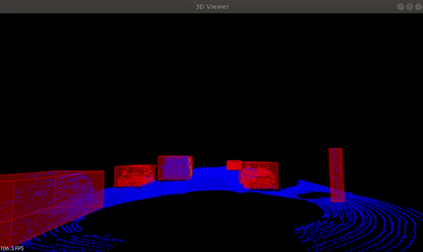

# Project  - Lidar Obstacle Detection

## Project Goal

In this Project , 

Given a stream of PCL

1)  Given Steam of PCL is processed to segment the road from the vehicles and place bounding boxes around the detected obstacles.
2)  RANSAC, KD-Tree, and Euclidean clustering algorithm are implemented from scratch as a part of your processing pipeline.

## The results 

## Dependencies for Running Locally

* cmake >= 2.8
  * All OSes: [click here for installation instructions](https://cmake.org/install/)
* make >= 4.1 (Linux, Mac), 3.81 (Windows)
  * Linux: make is installed by default on most Linux distros
  * Mac: [install Xcode command line tools to get make](https://developer.apple.com/xcode/features/)
  * Windows: [Click here for installation instructions](http://gnuwin32.sourceforge.net/packages/make.htm)
* PCL, C++
  * The link here is very helpful,  https://larrylisky.com/2014/03/03/installing-pcl-on-ubuntu/
* gcc/g++ >= 5.4
  * Linux: gcc / g++ is installed by default on most Linux distros
  * Mac: same deal as make - [install Xcode command line tools](https://developer.apple.com/xcode/features/)
  * Windows: recommend using [MinGW](http://www.mingw.org/)

## Basic Build Instructions

1. Clone this repo.
2. Make a build directory in the top level directory: `mkdir build && cd build`
3. Compile: `cmake .. && make`
4. Run it: `./environment`.

